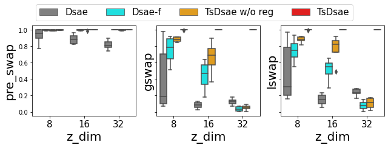
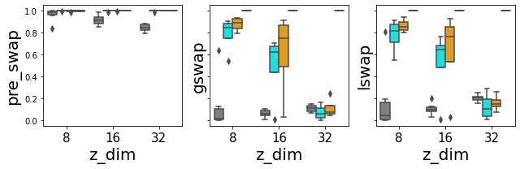

# Bottleneck-Anchor-Disentangle: A VAE framework

BAD-VAE is a developing framework for unsupervised disentanglement of sequential data.

Audio samples can be found in https://yjlolo.github.io/dSEQ-VAE.

## News
- (22/5/1) Publish code for the paper *Towards Robust Unsupervised Disentanglement of Sequential Data —
A Case Study Using Music Audio* accepted to IJCAI-22. Provide the DMelodies dataset and evaluation of the global latent space using LDA.

## Additional results
We obtain additional results by running `./scripts/benchmark/DMelodies/run_*.sh` which trains and evaluates the configurations using DMelodies with six random seeds, the three sizes of the local latent space, and either with or without the `amsgrad` variant of the ADAM optimiser. With the four models, this amounts to 144 checkpoints whose LDA F1 scores are summarised below. The evaluation is performed using the code defined under `test_epoch_end()` in `src/models/base.py`.


The top and bottom figures correspond to `amsgrad` being `False` and `True`, respectively, and the variance is due to the six random seeds.
It shows that the proposed TS-DSAE performs the best in terms of learning a semantically meaningful global latent space (i.e. instrument identity), and is robust against the random seeds, optimisers, and hyperparameters.

Similarly, we run `./scripts/benchmark/Urmp/run_*.sh` and provide the results for the URMP dataset.





Once again, the proposed TS-DSAE is robust in terms of disentanglement.

## Installation

Clone the project and the submodule:

```
git clone https://github.com/yjlolo/dSEQ-VAE.git --recurse-submodules
```

`cd dSEQ-VAE` and install the dependencies (virtual environment recommended):

```
pip install -r requirements.txt
```

`cd data/dmelodies_dataset` and `git lfs pull --include dMelodies_dataset_latent_info.csv` as labels of the dataset will come in handy. 
Otherwise, simply `rm data/dmelodies_dataset/dMelodies_dataset_latent_info.csv` (and don't do `git lfs pull`) to delete the placeholder of the lfs-tracked file; the file can be generated later on.

Finally, `source env.sh` to include the necessary paths.

## Data

- **DMelodies**:
Download the audio files from [Zenodo](https://zenodo.org/record/6540603), unzip and put `wav_datasets` under `data/dmelodies_dataset/`.

- **URMP (TODO)**:
Follow the script provided from [Hayes et al.](https://github.com/ben-hayes/neural-waveshaping-synthesis#data) to process the data.
Set the `--output-directory` as `data/{dir_name}` when `create_dataset.py`, with `{dir_name}` replaced.
In this repo, modify both `datasets.train.path_to_data` and `datasets.val.path_to_data` under `conf/data/urmp.yaml` as the `dir_name`.

## Usage
To train a model, run

```
./scripts/run_{model}.sh
```

with `{model}` replaced with one of the four model options `dsae`, `freeze`, `tsdsae_woReg` and `tsdsae`.
See `conf/` for full configurations.

For debugging purpose, run the following instead for a sanity check.

```
python train.py train.pl_trainer.fast_dev_run=True
```

## TODO
- [x] Upload benchmark results from running `./scripts/benchmark/run_*.sh`
- [x] Upload audio samples for melody swapping
- [ ] Test and streamline URMP process
- [x] Elaborate `README.md`
- [ ] Publish evaluation code for the local latent using Crepe
