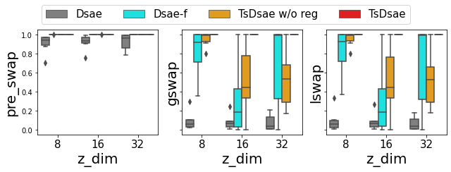
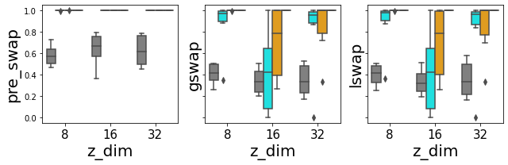

# Bottleneck-Anchor-Disentangle: A VAE framework

BAD-VAE is a developing framework for unsupervised disentanglement of sequential data.

Audio samples can be found in https://yjlolo.github.io/dSEQ-VAE.

## News
- (22/5/1) Publish code for the paper *Towards Robust Unsupervised Disentanglement of Sequential Data —
A Case Study Using Music Audio* accepted to IJCAI-22. Provide the DMelodies dataset and evaluation of the global latent space using LDA.

## Additional results
We provide the result from running `./scripts/benchmark/run_*.sh` which trains and evaluates the configurations using DMelodies with six random seeds, the three sizes of the local latent space, and either with or without the `amsgrad` variant of the ADAM optimiser. With the four models, this amounts to 144 checkpoints whose LDA F1 scores are summarised below. The evaluation is performed using the code defined under `test_epoch_end()` in `src/models/base.py`.

The top and bottom figures correspond to `amsgrad` being `False` and `True`, respectively, and the variance is due to the six random seeds.
It shows that the proposed TS-DSAE performs the best in terms of learning a semantically meaningful global latent space (i.e. instrument identity), and is robust against the random seeds, optimisers, and hyperparameters.

## Usage
`source env.sh` to include necessary paths, and `./scripts/run_{model}.sh` with `{model}` replaced with one of the four models `dsae`, `freeze`, `tsdsae_woReg` and `tsdsae`.
Possible configurations can be found under `conf/`.

## TODO
- [x] Upload benchmark results from running `./scripts/benchmark/run_*.sh`
- [x] Upload audio samples for style transfer
- [ ] Elaborate `README.md`
- [ ] Publish evaluation code for the local latent using Crepe
