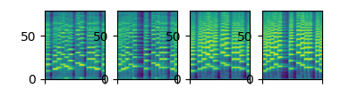

More audio samples to come.

## DMelodies

Given a source in violin and a target in trumpet, we can swap their local latent which represents melody without changing instrument identity by leaving the global latent unchanged.

| Source (violin) | Source post local swap | Target post local swap | Target (trumpet) |
| --------------- | ---------------------- | ---------------------- | -----------------|
| <audio src="audio/test-source_8003_b427bae0cf9586288311.wav" controls="" preload=""></audio> | <audio src="audio/test-source_swap_8003_75df9c7e9359ac3b8cf0.wav" controls="" preload=""></audio> | <audio src="audio/test-target_swap_8003_617329d94ac6b0c96ead.wav" controls="" preload=""></audio> | <audio src="audio/test-target_8003_44c2c0de7f4fb11f384b.wav" controls="" preload=""></audio> |

Melody of the second sample is replaced with that of the target sample, while the timbre remains unchangd.
The figures below are the corresponding spectrograms.

## Contact 
yin-jyun.luo@qmul.ac.uk
